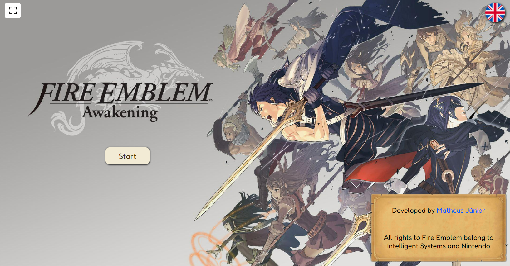

[NEXT__BADGE]: https://img.shields.io/badge/next.js-000000?style=for-the-badge&logo=nextdotjs&logoColor=white
[TYPESCRIPT__BADGE]: https://img.shields.io/badge/typescript-000000?style=for-the-badge&logo=typescript
[SASS__BADGE]: https://img.shields.io/badge/sass-000000?style=for-the-badge&logo=sass
[PROJECT__BADGE]: https://img.shields.io/badge/📱Visit_this_project-000?style=for-the-badge&logo=project
[PROJECT__URL]: https://fire-emblem-awakening-conversations.vercel.app/

# Fire Emblem Awakening - Conversations 💻

![next][NEXT__BADGE]
![typescript][TYPESCRIPT__BADGE]
![sass][SASS__BADGE]

[](/LICENSE)  

[](./public/ProjectHomeImage.png)

## 📌 About

A project made by me (Matheus Junior), where you can select a pair of characters from the game: “Fire Emblem Awakening”, to watch a dialogue between them — the same as support log from the original game.

This project was build in `Next.js` version `14.2.3` using `App Router` render mode.

[![project][PROJECT__BADGE]][PROJECT__URL]

## 🤔 How to run the project in your device?

```bash
# Clone this repository
$ git clone https://github.com/MatheusJunior2334/Fire_Emblem_Awakening-Conversations.git

# Navigate to the project directory
$ cd fire-emblem_conversations

# Install the dependencies
$ npm install

# Run the project
$ npm run dev
# Alternatively, you can use:
$ yarn dev
# or
$ pnpm dev
# or
$ bun dev
```

Open [http://localhost:3000](http://localhost:3000) in your browser to see the result.

## ✍ Credits

This project incorporates images and icons from the following sources:

- [Fire Emblem Wars of Dragons](https://www.fireemblemwod.com/) and [Fandom - Fire Emblem](https://fireemblem.fandom.com/wiki/Fire_Emblem_Awakening): for characters images
- [Fire Emblem Wiki](https://fireemblemwiki.org/): for characters gifs
- [Icons8](https://icons8.com/) and [UXWing](https://uxwing.com/): for icons

All rights to Fire Emblem Awakening belong to [Nintendo](https://www.nintendo.com/us/) and [Intelligent Systems](https://www.intsys.co.jp/).

## 🎨 Creator

<table>
  <tr>
    <td align="center">
      <a href="https://www.linkedin.com/in/matheus-júnior">
        <br>
        <sub>
          <b>Matheus Júnior</b>
          <br />
          <a href="#" title="Code">💻</a>
          <a href="#" title="Design">🎨</a>
        </sub>
      </a>
    </td>
  </tr>
</table>

## 📝 License

This project is licensed under the [MIT](/LICENSE) Licence